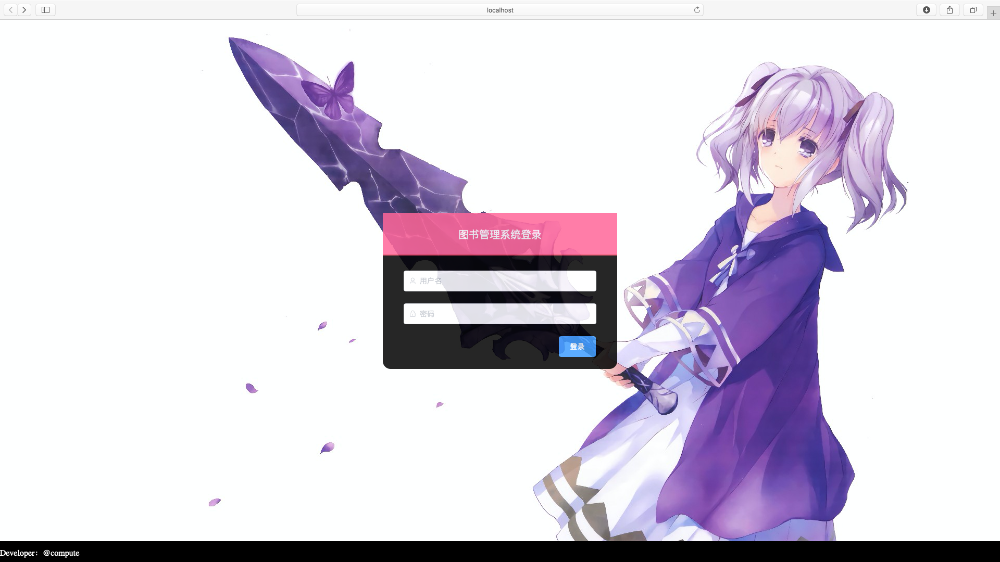
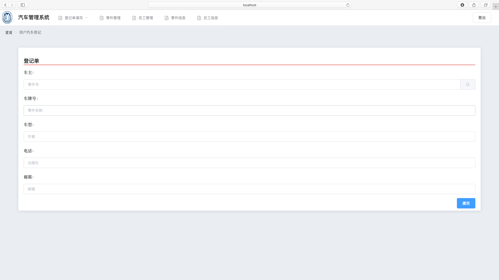
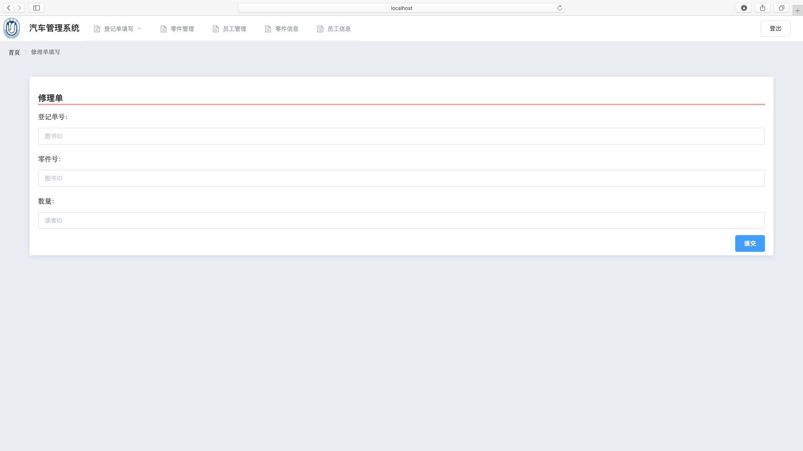
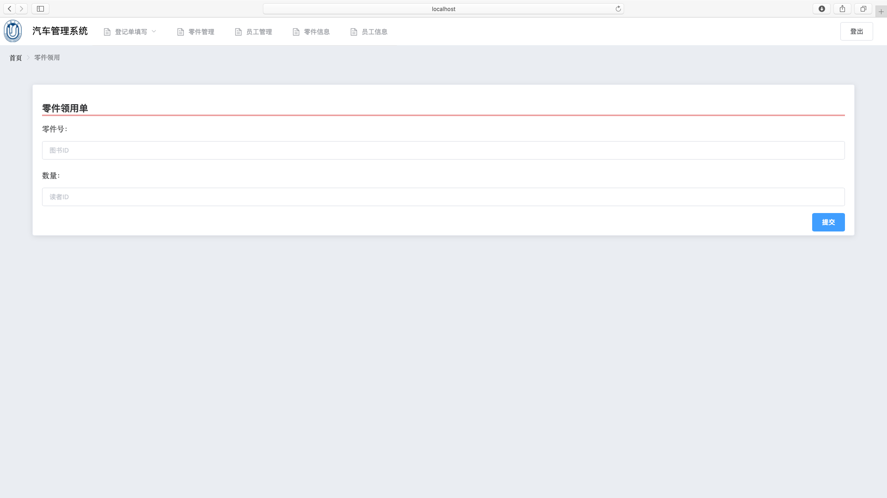
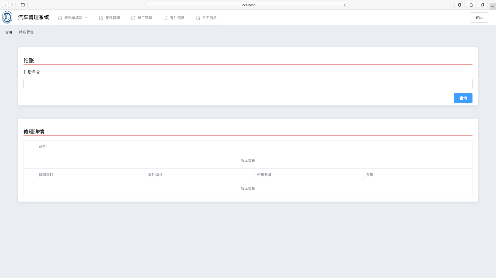
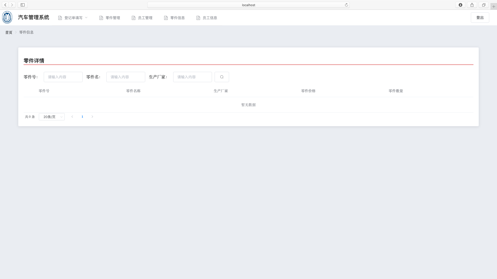
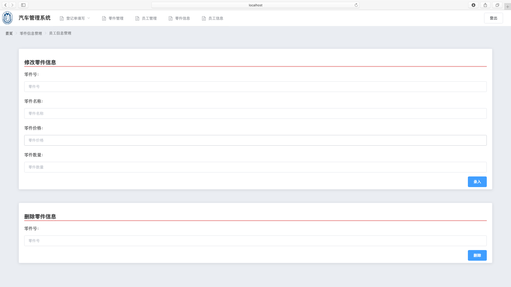
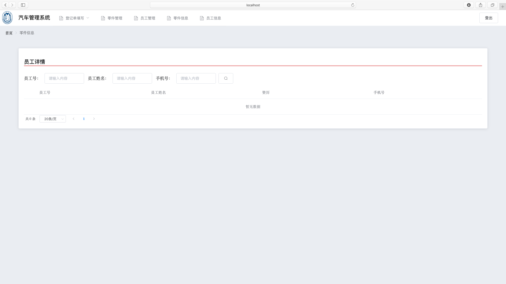
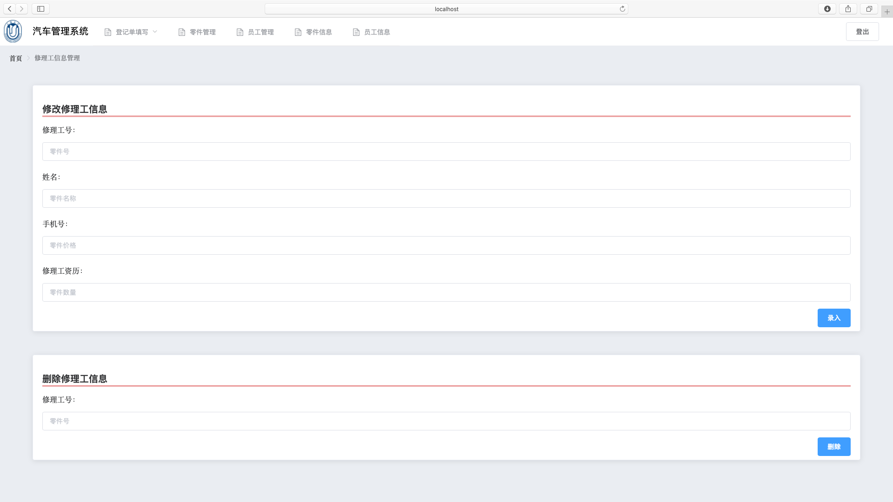

[toc]

# 目的、要求与内容
对应之前在需求分析，概要设计等阶段所规划的面向设计方法，数据库模式，针对业务要求进行程序编写。要求最后的程序大致上运行无误，完成前后端交互以及业务逻辑实现。


# 详细设计文档

## 数据库
数据库使用mysql，服务器url: 62.234.98.144:3306/carmechanic

### 业务信息 Service
所有表项中，列名带id字段的列均为自增主键
- 汽车登记单（登记单号，车主，车牌号，注册日期，车型，电话，邮箱）
  - client_car (register_id, owner_name, car_id, register_date, car_type, owner_phone,, owner_email)
- 汽车修理单（修理单号，登记单号，员工工号，修理项目，零件编号，完工日期）
	- client_repaire (repair_id, register_id, mehanic_id, repair_task, carpart_id, finish_date)
- 零件领用单（领用编号，修理单编号，零件号，数量，领用日期）
	- carpart_usage (usage_id, repair_id, carpart_id, usage_amount, usage_date) 
- 结账单（结账单号，登记单号，费用，结账日期）
	- client_bill (bill_id, register_id, payment, pay_date)

### 实体信息 Domain
所有表项中，列名带有id字段的列均为变长字符串主键
- 修理工表（修理工工号，姓名，资历，手机号）
	- mechanic_info (machanic_id, machanic_name, machanic_lv, machanic_phone)
- 零件表（零件编号，零件名称，生产厂商，零件价格，零件数量）
	- carpart_info (carpart_id, carpart_name, manufacturer, carpart_price, reserve_amount)	

### 系统信息 System
- 用户信息表（用户ID，用户身份， 用户密码， 用户邮箱）
	- user_info (user_id, user_role, user_password, user_email)
- 身份权限表（身份名称，接口地址，是否可以访问）
	- role_privilege (user_role, interface_url, access_permit)

## 后端

### 持久层(domain,mappper)
持久层是支持对于数据进行持久化的类，包含对于数据库进行crud的方法以及对应的实体。

#### Domain Class规范说明
1. Domain Class统一通过Mybatis Code Generator生成，满足Java Bean规范，不得随意修改。
2. Domain Class可以直接设置在Result中，使用Mapper Interface的场景，只可使用Domain Class作为参数或者返回结果。
3. Domain Class包含了Example Class，Example Class是MGB自动生成以方便crud，使用时通过Example.Criteria设置相应的查询规则。

#### Domain Class详细说明
Domain Class是数据库每一张表所对应的实体，Example Class名字与其相同位于example包内
- CarpartUsage
- CarpartInfo
- ClientBill
- ClientCar
- MechanicInfo
- ClientRepair
- RolePrivilege
- UserInfo

#### Mapper Interface规范说明
1. Mapper类统一通过Mybatis Code Generator生成，不得随意修改（代码位于util.generator包中），在resources的对应包中是相应的xml文件。
2. Mapper涉及到主键的crud请使用带PrimaryKey的方法，涉及到特定条件的增删改查请使用带Example字段的方法。
3. Mapper只可被Service调用。

#### Mapper Interface详细说明
对于每个Mapper Interface，他的名字既对应他所操作的表：
- CarpartInfoMapper
- CarpartUsageMapper
- ClientBillMapper
- ClientCarMapper
- ClientRepairMapper
- MechanicInfoMapper
- RolePrivilegeMapper
- UserInfoMapper

### 业务层(service)
业务层是对业务进行处理的类，也包含数据封装和异常处理。

#### Service Class规范说明
1. 业务层类名称必须以Service结尾，放在service包中，使用@Service注解。
2. 业务层统一提取为接口。
3. 业务层可以通过依赖注入调用Mapper接口或者其他业务类。
4. 业务层类进行数据库访问的代码需要位于try-catch代码块中，并捕获DataAccessException或是以其为父类的异常类。
5. 业务层类使用@Transactional(rollbackFor = DataAccessException.class)注解开启数据库事务回滚。
6. 业务层类方法无论是否需要都需返回Result类，并设置相应的ResultCode，Result类位于util.result包中。

#### Service Class详细说明
**汽车信息登记类**
- ClientRegisterService
	- 对于表client_car的crud
	- 对于业务，提交汽车登记单的处理
```
public interface ClientRegisterService {

    /**
     * handling the query of client car with optional params and divided pages
     * @param clientCar
     * @param pageNum
     * @param pageSize
     * @return
     */
    Result getClientCar(ClientCar clientCar, int pageNum, int pageSize);

    /**
     * handling the service of deliver the client register form
     * @param clientCar
     * @return
     */
    Result doClientRegister(ClientCar clientCar);
}
```
**汽车修理处理类**
- ClientRepairService
	- 对于表client_repair的crud
	- 对于业务，提交汽车维修单的处理
```java
public interface ClientRepairService {

    /**
     * handling the query of client repair with optional params and divided pages
     * @param clientRepair
     * @param pageNum
     * @param pageSize
     * @return
     */
    Result getClientRepair(ClientRepair clientRepair, int pageNum, int pageSize);

    /**
     * handle the service of delivering client repair form
     * @param clientRepairList
     * @return
     */
    Result doClientRepair(List<ClientRepair> clientRepairList);
}
```
**零件领用处理类**
- CarPartService
	- 对于表carpart_info的crud
	- 对于表carpart_usage的crud
	- 对于业务，提交领用零件单的处理
```java
public interface CarPartService {

    /**
     * handling the query of car part with optional params and divided pages
     * @param carpartInfo
     * @param pageNum
     * @param pageSize
     * @return RESULT_DATA_NONE, INTERFACE_INNER_INVOKE_ERROR, SUCCESS(CarPartList)
     */
    Result getCarPartInfo(CarpartInfo carpartInfo, int pageNum, int pageSize);

    /**
     * handling the update of car part, either insert or update
     * @param carpartInfo
     * @return INTERFACE_INNER_INVOKE_ERROR, SUCCESS(carpartInfo)
     */
    Result updateCarPartInfo(CarpartInfo carpartInfo);

    /**
     * handle the delete of car part info
     * @param carPartId
     * @return RESULT_DATA_NONE, INTERFACE_INNER_INVOKE_ERROR, SUCCESS
     */
    Result deleteCarPartInfo(Integer carPartId);

    /**
     * handle the query of car part usage
     * @param repairId
     * @return RESULT_DATA_NONE, INTERFACE_INNER_INVOKE_ERROR, SUCCESS(usageList)
     */
    Result getCarPartUsage(Integer repairId);

    /**
     * handle the submit of carpartUsage
     * @param carpartUsage
     * @return RESULT_DATA_NONE, INTERFACE_INNER_INVOKE_ERROR, SUCCESS(carpartUsage)
     */
    Result submitCarPartUsage(CarpartUsage carpartUsage);
}
```

**结账信息处理类**
- ClientPaymentService
	- 对于表client_bill的crud
	- 对于业务，提交客户结账单的处理
```java
public interface ClientPaymentService {

    /**
     * handle the query of client bill
     * @param registerId
     * @return
     */
    Result getClientBill(Integer registerId);

    /**
     * handle the yield of client bill, with repair form input
     *
     * @param registerId
     * @param clientRepairList
     * @return
     */
    Result makeClientBill(Integer registerId, List<ClientRepair> clientRepairList);
}
```

**用户登录处理类**
- UserService
	- UserService继承了Spring Security中UserDetailsService接口，可以直接配合Config的AOP设置。
	- UserService实现了loadUserByUsername方法
	- 依赖UserInfoMapper


### 控制层(controller)


## 接口
在前后端分离的场景中，后端提供给前端获取数据的查询接口，遵循http协议，设计时采用restful风格的api设计。restful风格，就是以json数据为信息交互的格式，以get,post为基本的http通信方法，对于每一个uri的设计都需要使用动词和名词来指定接口的操作和具体的信息。

### 接口url总表

**接口说明**
* 需要授权的API，必须在请求头中用 `authorization` 字段提供 `token` 令牌
* 数据返回格式统一使用 JSON
* 除login以外的post输入数据请在请求头`Content-Type`指定为`application/json;charset=utf-8`

系统管理url:
- post /login
	- 登录页面 
- get /carpart/list
	- 零件一览
- get /carregister/list
	- 注册车辆一览
- get /carrepair/list
	- 汽车修理状态一览
- post /altercarpart
	- 汽车零件信息修改
- post /delcarpart
	- 汽车零件信息删除
- post /altermechanic
	- 修理工信息修改
- post /delmechanic
	- 修理工信息删除
业务需求url:
post方法
- post /carregister
	- 递交汽车注册单
- post /carrepair
	- 递交汽车修理单
- post /carpart
	- 递交零件领用单
get方法：
- get /carregister
- get /carrepair
- get /carpart

### 接口详情

#### 系统管理url
**post /login**

**get /carpart**
请求参数：

```
carpartId: '',
carpart_name: '',
manufacturer: '',
pagenum: 1,
pagesize: 20
```
响应参数：
```
carpartId,
carpartName,
manufacturer,
carpartPrice,
reserveAmount
```

**post /altercarpart**
请求参数：

```
carpartId: '',
carpart_name: '',
manufacturer: '',
carpart_price: '',
reserve_amount: ''
```
响应参数：
```
httpstatue
```

** post /deletecarpart**
请求参数：

```
id_del
```
响应参数：
```
httpstatue
```

**post /altermechanic**
请求参数：

```
mechanicId: '',
mechanic_name: '',
mechanicLv: '',
mechanic_phone: '',
```
响应参数：
```
httpstatue
```

**post /delmechanic**
请求参数：
```
id_del
```
响应参数：
```
httpstatue
```

**post /register**
请求参数：

```
owner_name: '',
car_id: '',
car_type: '',
owner_phone: '',
owner_email: ''
```
响应参数：
```
httpstatue
```

**post /repair**
请求参数：

```
register_id: '',
mechanic_id: "user_id",
carpartId: '',
repair_task: ''
```
响应参数：
```
httpstatue
```

**post /usage**
请求参数：

```
carpartId: '',
usage_amount: ''
```
响应参数：
```
httpstatue
```

### http状态码补充
http协议自身的状态码较为有限，而restful风格的api设计是需要更加全面，更加清晰的接口状态的反馈，因此需要对状态码进行补充，http状态码表如下所示：
```java
    /* 成功状态码 */
    SUCCESS(1, "成功"),

    /* 参数错误：10001-19999 */
    PARAM_IS_INVALID(10001, "参数无效"),
    PARAM_IS_BLANK(10002, "参数为空"),
    PARAM_TYPE_BIND_ERROR(10003, "参数类型错误"),
    PARAM_NOT_COMPLETE(10004, "参数缺失"),

    /* 用户错误：20001-29999*/
    USER_NOT_LOGGED_IN(20001, "用户未登录"),
    USER_LOGIN_ERROR(20002, "账号不存在或密码错误"),
    USER_ACCOUNT_FORBIDDEN(20003, "账号已被禁用"),
    USER_NOT_EXIST(20004, "用户不存在"),
    USER_HAS_EXISTED(20005, "用户已存在"),

    /* 业务错误：30001-39999 */
    SPECIFIED_QUESTIONED_USER_NOT_EXIST(30001, "某业务出现问题"),

    /* 系统错误：40001-49999 */
    SYSTEM_INNER_ERROR(40001, "系统繁忙，请稍后重试"),

    /* 数据错误：50001-599999 */
    RESULE_DATA_NONE(50001, "数据未找到"),
    DATA_IS_WRONG(50002, "数据有误"),
    DATA_ALREADY_EXISTED(50003, "数据已存在"),

    /* 接口错误：60001-69999 */
    INTERFACE_INNER_INVOKE_ERROR(60001, "内部系统接口调用异常"),
    INTERFACE_OUTTER_INVOKE_ERROR(60002, "外部系统接口调用异常"),
    INTERFACE_FORBID_VISIT(60003, "该接口禁止访问"),
    INTERFACE_ADDRESS_INVALID(60004, "接口地址无效"),
    INTERFACE_REQUEST_TIMEOUT(60005, "接口请求超时"),
    INTERFACE_EXCEED_LOAD(60006, "接口负载过高"),

    /* 权限错误：70001-79999 */
    PERMISSION_NO_ACCESS(70001, "无访问权限");

```

# 前端（用户手册）
### 页面详情
#### service 页面
业务必须页面

**用户登录页面**
- 权限：无限制
- url: /login
- 功能：用户的登录


**汽车登记页面**
- 权限：管理员
- url:  /register
- 功能：提交汽车登记单


**汽车修理页面**
- 权限：管理员，员工
- url: /repair
- 功能：提交汽车修理单


**零件领用页面**
- 权限：管理员，员工
- url: /usage
- 功能：提交零件领用单


**结账页面**
- 权限：无限制
- url: /bill
- 功能：根据单号查询结账情况


#### system 页面
业务所需以外的系统管理页面

**零件信息查看页面**
- 权限： 管理员，员工
- url: /carpart
- 功能：查看零件库存，分页，带可选搜索


**零件信息更新页面**
- 权限：管理员
- url: /carpart_manage
- 功能：更新零件信息，可以是新增或者更新


**员工信息查看页面**
- 权限：管理员，员工
- url: /mechanic
- 功能：查看所有员工信息，分页，带可选搜索


**员工信息更新页面**
- 权限：管理员
- url: /mechanic_manage
- 功能：更新员工信息，可以是新增或者更新
 

# 测试数据库设计


