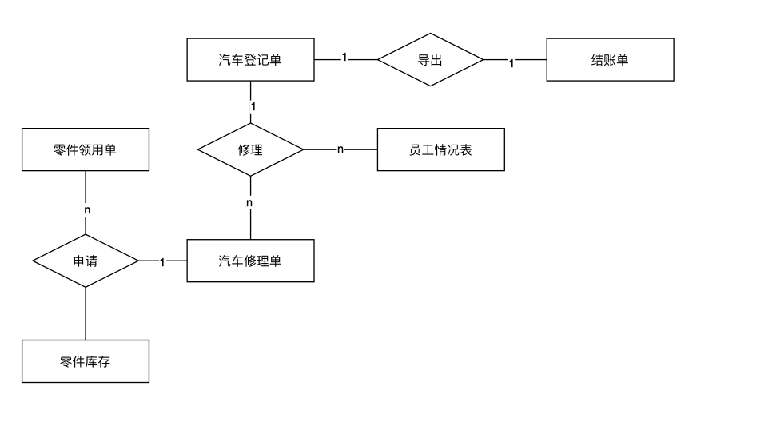
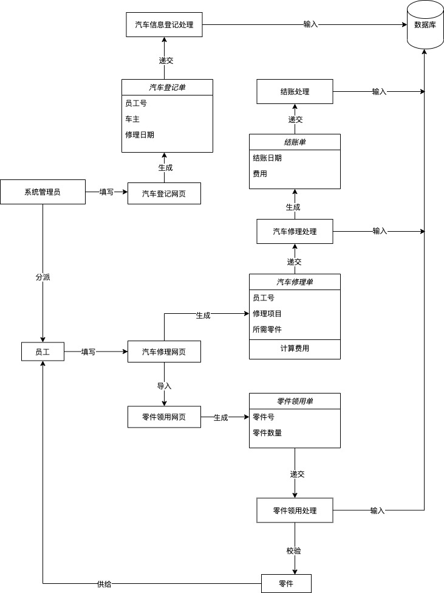

### 可行性分析
汽车修理相关的零件大多繁杂，人工管理耗时费力。同时人工处理维修业务也是一个复杂的工作，因此将管理业务和零件库存进行计算机管理，可以显著提高效率。
采用数据库系统进行实现，并使用web网页作为交互手段，这是一种已经十分成熟的实现方式。
技术需求如下：
使用的高级语言是Java，JDK版本1.8，项目整体采用前后端分离架构，前端负责展示从后端ajax中获取数据。
- 数据库
    - Mysql 数据库
    - mybatis 是持久化开发框架，所谓持久化，既保存数据。直⽩的说，就是负责与数据库进⾏交互 的框架。mybaits 实现了JDBC规范（JDBC规范是J2EE的ORM式数据库访问规范，定义了数据库访 问接⼝，所有提供数据库访问的应⽤必须实现JDBC接⼝）。mybatis提供了使⽤xml⽂件进⾏数据 库表与Java对象的映射，也可在xml中编写sql语句，并将其映射⾄Java类，实现sql语句软编码， 既sql语句发⽣变化时⽆需重新编译。mybatis还提供了mybati code generator⼤⼤便利了开发。
- 后端框架
    - springboot 是基于 spring, spring mvc 所开发的简化配置的服务端开发框架。
    - spring 是企业级开发框架，为开发⼤型企业级应⽤提供了便利，对个⼈开发者来说同样是开 发利器。提供了最⼩侵⼊式编程的特性，提倡POJO原则，既使⽤最简单的Java类(Plain Old Java Object)实现企业级开发功能，同时提供了依赖注⼊容器，可以直接将对象的⽣命周期管 理委托给框架，⼤⼤减⼩了类与类之间耦合的程度。另外具备 AOP 功能，使项⽬可进⾏横向 编程，可不改变原有代码的情况增加业务逻辑。
    - spring mvc 是实现了servlet规范（servlet是J2EE规范对于实现http的web应⽤所定义的接 ⼝，所有提供web服务的应⽤都必须实现servlet接⼝），基于spring开发的web应⽤服务端 框架，实现了MVC设计模式。由于使⽤了spring进⾏开发，同样具有最⼩侵⼊式编程的特 性。对于开发者来说，⽆需显式的调⽤任何类库，⽽是直接使⽤编译注解，就能让⽅法提供 web服务。 
    - spring boot 是简化了spring mvc 和 spring 配置的spring 家族升级版web 后端开发框架， 堪称Java 后端开发的颠覆者，内部直接集成了服务器如Tomcat。
- 前端
- 测试框架
    - Junit是单元测试框架，上手相当简单快速，对spring家族和mybatis都有良好的支持，使用mockMVC配合assert断言可以对网络接口进行方便快速的调试，运行快速，无需启动环境如TOMCAT。
    - Postman一款模拟http请求的接口测试框架，适合在前后端分离场景下使用
- 项目管理
    - Maven是一个由appache基金会管理的java包管理工具，功能及其强大。
    - Github是使用知名分布式项目管理工具Git的开源代码仓库，由Linus为了Linux项目而创建

### 需求分析
汽车修理厂修理汽车的业务的系统流程图如下：

根据业务流程，我们可以简单得出实现以下流程的需求：

1. 系统管理：
	⑴ 管理用户：包括用户的添加、修改、删除，退出
	⑵ 修改密码：包括旧密码、新密码及新密码的确认
	⑶ 注销用户：退回到登陆模式
	⑷ 退出系统：退出
	
2. 基本信息：
	⑴ 零件基本信息：包括的功能有零件的添加、修改、删除、查询
	⑵ 汽车基本信息：包括的功能有汽车的添加、修改、删除、查询
	⑶ 修理工基本信息：包括的功能有修理工的添加、修改、删除、查询
	
3. 表单操作：
	⑴ 修车登记单：包括的功能有修车登记的添加、修改、删除、查询
	⑵ 汽车修理单：包括的功能有汽车修理的添加、修改、删除、查询
	⑶ 零件入库单：包括的功能有零件入库的添加、修改、删除、查询
	⑷ 零件领用单：包括的功能有零件领用的添加、修改、删除、查询
	⑸ 修车结账单：包括的功能有修车发票的添加、修改、删除、查询

根据以上需求，我们可以得出一个er图

### 概要设计
面向对象模型如下：

数据库方面设计如下关系模式：
- 汽车登记单（登记单号，车主，车牌号，修理日期，车型，电话）
- 汽车修理单（修理单号，登记单号，员工工号，修理项目，零件编号，完工日期）
- 零件领用单（修理单编号，零件号，数量，领用日期）
- 结账单（结账单号，登记单号，费用，结账日期）
- 员工表（员工工号，姓名，年龄，员工资历）
- 零件表（零件编号，零件名称，生产厂商，零件价格，零件数量） 
  
